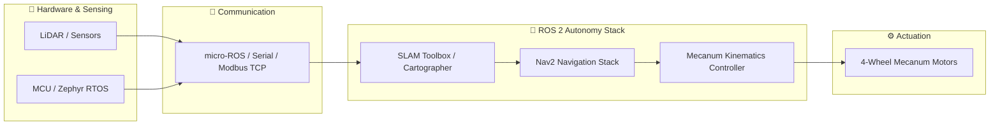

<div align="center">

# 🤖 Hi there, I'm Chananya Meepayung (I-Aun) 👋

<a href="https://git.io/typing-svg">
  
</a>

<p align="center">
  <b>Passionate about developing intelligent robotic systems, autonomous mobile robots (AMR), and real-time embedded control.</b>
</p>

<!-- Social & Contact Badges -->
<p align="center">
  <a href="https://www.linkedin.com/in/chananya-meepayung-b39335356/"></a>
  <a href="mailto:chananyaaun123@gmail.com"></a>
  
</p>

</div>

---

### 👨‍💻 About Me

- 🔭 **Current Focus:** Autonomous Mobile Robots (AMR), ROS 2 Navigation Stack (Nav2), and SLAM mapping algorithms.
- 🦾 **Robotics Software:** Architecting modular ROS 2 nodes, multi-robot communication, simulation modeling, and hardware interfaces.
- ⚡ **Embedded & IoT:** Developing firmware for microcontrollers utilizing **Zephyr RTOS**, **micro-ROS**, and **Modbus TCP** communication protocols.
- 💬 **Ask Me About:** ROS 2 (Humble / Jazzy), Mecanum 4-Wheel Kinematics, Gazebo Simulation, and C++/Python development.

---

### 🎓 Education & Research

```
🎓 Mechatronics Engineering Technology (MtET)
├── 📜 Thesis: Autonomous Mobile Robot Mecanum Four Wheels with ROS 2
├── 🔬 Research Focus: Mobile Robot Kinematics, SLAM, Nav2, Sensor Fusion
└── ⚙️ Core Knowledge: Control Systems, Industrial Automation, Embedded Real-Time OS
```

---

### 🤖 Autonomy & System Architecture



---

### 🛠️ Tech Stack & Skills

#### 🤖 Robotics & Simulation
<p>
  
  
  
  
  
</p>

#### 💻 Programming Languages
<p>
  
  
  
  
</p>

#### 🔌 Embedded, Hardware & Industrial IoT
<p>
  
  
  
  
</p>

#### 🧰 Tools & Frameworks
<p>
  
  
  
  
</p>

---

### 🚀 Highlighted Projects

| Project | Description | Tech Stack |
| :--- | :--- | :--- |
| 🛡️ [**mecanum-4-wheel-ros2**](https://github.com/iaun123/mecanum-4-wheel-ros2) | **Autonomous Mobile Security Robot (MtET Thesis)**<br>Featuring 4-wheel Mecanum drive kinematics, ROS 2 Nav2 autonomous navigation, and 2D/3D SLAM mapping. | `ROS 2` `Python` `SLAM` `Nav2` `Gazebo` |
| ⚙️ [**mini-project-MtET64**](https://github.com/iaun123/mini-project-MtET64) | **Mechatronics & Robotics System Suite**<br>Comprehensive engineering projects covering robotics algorithms, automation control, and modern C++. | `C++` `Robotics` `Algorithms` `Control` |
| 💡 [**app**](https://github.com/iaun123/app) | **Weather Lamp Application**<br>Interactive IoT & smart device application combining environmental monitoring with ambient control. | `Python` `Flask` `IoT` |
| 📚 [**book_shelf**](https://github.com/iaun123/book_shelf) | **Digital Book & Knowledge Collection**<br>Curated technical resources and engineering reference management. | `Markdown` `Documentation` |

---

### 📊 GitHub Activity & Analytics

<div align="center">
  
  
</div>

<div align="center">
  
</div>

---

### 🐍 Contribution Activity

<div align="center">
  
</div>

---

<div align="center">
  <i>"Building the bridge between hardware precision and intelligent software."</i><br>
  <sub>Designed & Developed by <a href="https://github.com/iaun123">Chananya Meepayung</a></sub>
</div>
